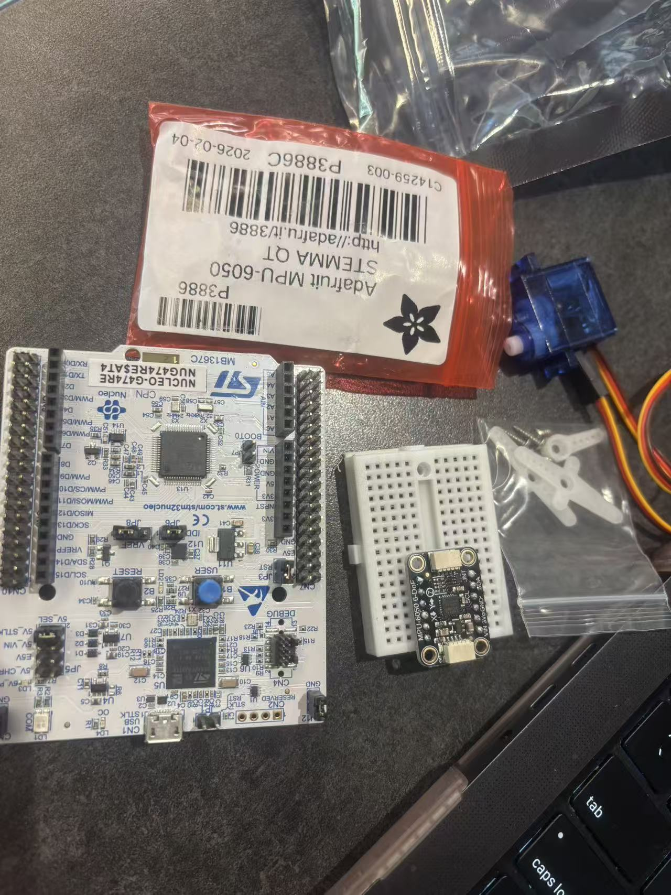
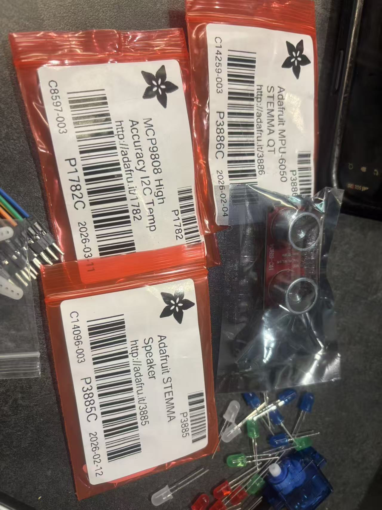

# Smart Kids Bike Safety System

A safety device designed for kids riding bikes at night. Cars can detect a bike going straight, but they cannot always predict a turn. This system focuses on two practical safety features:

1. **Turn Signal Indicators**: bright flashing LEDs warn cars when the rider is turning left or right.
2. **Ultrasonic Radar Scanner**: a sweeping HC-SR04 sensor warns the rider of nearby obstacles with audio and visual alerts.

---

## Hardware Kit





Current components include:

- STM32 Nucleo development board
- MPU6050 IMU sensor: accelerometer and gyroscope
- MCP9808 high-accuracy I2C temperature sensor
- HC-SR04 ultrasonic distance sensor
- SG90 servo motors
- Speaker / buzzer module
- LEDs
- Breadboard
- Jumper wires

---

## Hardware Components

| Component | Role |
|---|---|
| STM32 Nucleo development board | Main microcontroller |
| MPU6050 IMU sensor | Roll angle detection through I2C |
| HC-SR04 ultrasonic distance sensor | Obstacle detection through GPIO and timer input capture |
| SG90 servo motor | Radar sweep through PWM |
| Speaker / buzzer module | Proximity audio alert through PWM tone |
| LEDs | Left turn, right turn, and proximity visual warnings |
| MCP9808 temperature sensor | Optional environmental monitor |
| Breadboard and jumper wires | Prototyping |

---

## Final Learning Directions

This final document keeps the roadmap focused on the bike safety system instead of separate phase documents.

### Embedded Control

- Program the STM32 Nucleo board
- Control LEDs through GPIO
- Generate PWM signals
- Move SG90 servos precisely
- Use serial output for debugging

### Sensor Systems

- Read MPU6050 motion data through I2C
- Measure object distance with the HC-SR04 ultrasonic sensor
- Optionally read MCP9808 temperature data through I2C
- Calibrate noisy sensor readings
- Build a simple computer-side sensor dashboard

### Robotics Feedback

- Convert sensor readings into decisions
- Use LEDs and the speaker for safety feedback
- Use servo motion as a physical scanning output
- Build closed-loop behavior with sensor feedback
- Explore proportional control and PID control later

Example robotics loop:

```text
Sensor input -> STM32 decision logic -> Servo / LED / speaker action
```

### AI and Data Collection

- Stream sensor data from STM32 to a computer
- Log distance, motion, vibration, and temperature data
- Visualize data in Python
- Train simple classifiers for motion or obstacle patterns
- Use model decisions to trigger safer robot actions

Example AI workflow:

```text
Sensor data -> Data collection -> Feature extraction -> Model -> Safety action
```

---

## Sub-System 1: Turn Signal Indicator

### How It Works

- The MPU6050 is mounted on the handlebar and measures roll angle through I2C.
- The STM32 reads roll continuously.
- If roll is above the right-turn threshold, the right LED flashes.
- If roll is below the left-turn threshold, the left LED flashes.
- Straight riding can keep both LEDs on as solid running lights.

### Peripherals Used

| Peripheral | Purpose |
|---|---|
| I2C | MPU6050 IMU data |
| GPIO output | Left LED and right LED |
| UART | Serial debug output |

---

## Sub-System 2: Ultrasonic Radar Scanner

### How It Works

- The SG90 servo sweeps the HC-SR04 sensor across an arc.
- The STM32 reads distance at each servo angle using timer input capture on the echo pin.
- If an object is detected inside the danger zone, the buzzer beeps faster.
- If an object is detected inside the critical zone, the buzzer switches to a continuous alarm tone.
- Proximity LEDs can show distance severity visually.

### Peripherals Used

| Peripheral | Purpose |
|---|---|
| GPIO output | HC-SR04 trigger pin |
| GPIO input + timer input capture | HC-SR04 echo pin pulse width measurement |
| PWM timer | SG90 servo sweep at 50 Hz |
| PWM timer | Buzzer tone generation |
| GPIO output | Proximity indicator LEDs |

---

## STM32 Logic Flow

```text
MPU6050 (I2C)
  -> Roll angle
  -> Left / right LED flash (GPIO)

HC-SR04 (GPIO + timer input capture)
  -> Distance
  -> Buzzer alert (PWM tone)
  -> Proximity LEDs (GPIO)

SG90 Servo (PWM 50 Hz)
  -> Radar scan arc
  -> Wider obstacle detection coverage
```

---

## Build Milestones

| Milestone | Goal |
|---|---|
| 1 | MPU6050 roll detection drives left and right LED turn signals |
| 2 | HC-SR04 distance reading drives buzzer proximity alerts |
| 3 | SG90 servo sweeps the ultrasonic sensor for radar scanning |
| 4 | Both sub-systems run together on one STM32 |
| 5 | Thresholds, LED brightness, and buzzer patterns are tuned for night riding |

---

## Peripheral Summary

| Peripheral | Usage |
|---|---|
| I2C | MPU6050 IMU and optional MCP9808 temperature sensor |
| GPIO output | LEDs and HC-SR04 trigger |
| GPIO input | HC-SR04 echo |
| Timer input capture | Echo pulse width to distance calculation |
| PWM | SG90 servo at 50 Hz and buzzer tone |
| UART | Serial debug |

---

## Project Brainstorming Directions

### Beginner Projects

- LED blink patterns
- Servo sweep
- Ultrasonic distance reader
- Motion detector
- Serial sensor monitor
- Temperature logger

### Intermediate Projects

- Bike turn-signal indicator
- Distance-based alarm
- Smart temperature warning system
- Servo-controlled ultrasonic scanner
- Tilt-controlled LED indicator
- Motion-activated LED and sound system

### Advanced Projects

- Full bike safety prototype
- Self-leveling sensor platform
- PID-controlled servo stabilizer
- Sensor fusion dashboard
- AI motion classifier
- Obstacle behavior detection system

### Creative Project Ideas

- Smart bike safety light
- Handlebar tilt gesture controller
- Mini radar display on a computer
- Night-riding warning system
- Interactive hardware demo box with LEDs, sound, servo motion, and sensors
- Sensor-based game controller

---

## Long-Term Robotics Roadmap

### Level 1: Embedded Basics

- STM32 programming
- GPIO
- PWM
- Servo control
- I2C sensors
- Basic serial debugging

### Level 2: Sensor Systems

- MPU6050
- MCP9808
- HC-SR04
- Sensor calibration
- Signal filtering
- Sensor dashboards

### Level 3: Control Systems

- Feedback control
- PID control
- Stabilization
- Servo-based correction
- Robotics kinematics basics

### Level 4: Robotics Integration

- Robot arms
- Mobile robots
- Obstacle detection
- Self-leveling platforms
- Multi-sensor behavior

### Level 5: AI Robotics

- Data collection
- Machine learning
- Computer vision
- ROS
- Autonomous navigation
- Reinforcement learning
- Human motion understanding

---

## Recommended First Full Project

### Smart Kids Bike Safety Prototype

Goal:

- Detect left and right turns from MPU6050 roll angle
- Flash the correct LED turn signal
- Sweep the HC-SR04 sensor using a servo
- Detect nearby obstacles
- Warn the rider with buzzer tones and proximity LEDs
- Tune thresholds for stable night-riding behavior

Why this project is a strong starting point:

- It uses both sensing and actuation
- It teaches I2C, GPIO, timers, and PWM together
- It has a real-world safety purpose
- It can grow into sensor fusion, AI classification, and more advanced robotics
